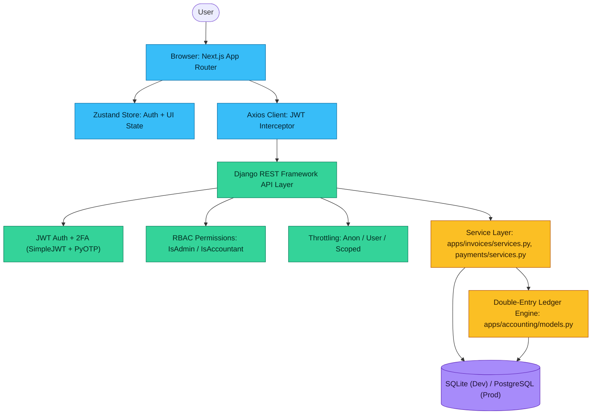
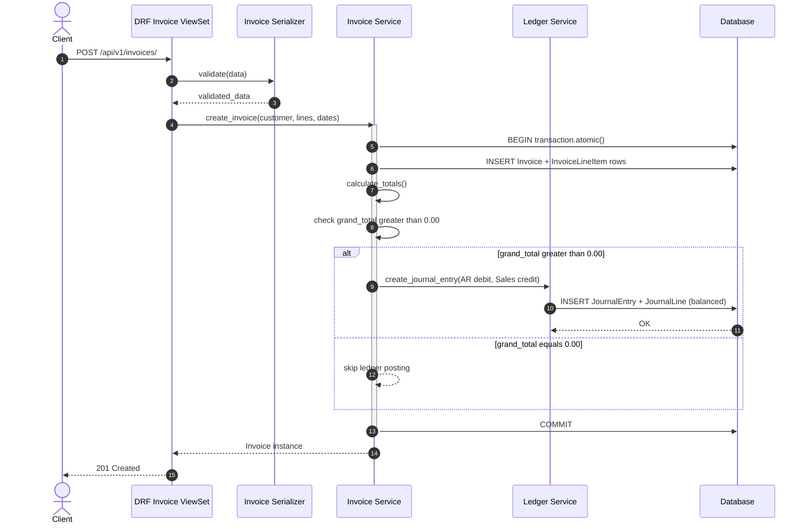
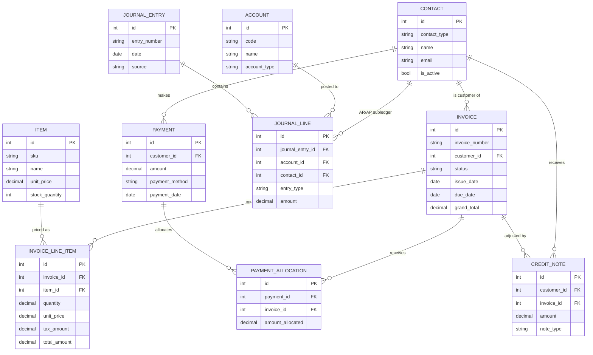

<div align="center">

# 📒 Nestmart IMAS

### Invoice Management & Accounting System

**A decoupled, double-entry accounting core with a modern invoicing and payments UI — built for correctness first.**

[](https://www.python.org/)
[](https://www.djangoproject.com/)
[](https://www.django-rest-framework.org/)
[](https://nextjs.org/)
[](https://react.dev/)
[](https://www.typescriptlang.org/)
[](https://tailwindcss.com/)
[](https://www.sqlite.org/)
[](https://www.postgresql.org/)
[](https://jwt.io/)
[](https://pytest.org/)

</div>

---

## 📖 Overview

**Nestmart IMAS** is a full-stack Invoice Management & Accounting System built around a single non-negotiable idea: **the ledger must always be correct.**

Most small-business invoicing tools bolt "accounting" on top of invoicing as an afterthought — a status flag here, a running balance there. Nestmart IMAS inverts that. Every money-moving action (an invoice going out, a payment coming in) is required to produce a **balanced, immutable, double-entry journal entry**. The invoicing and payments UI is really just a friendly front door to a strict general ledger underneath.

> **Business value:** decision-makers get a P&L and a dashboard that are *provably* derived from the same ledger that reconciles to the penny — not from a parallel set of "invoice totals" that can quietly drift out of sync with what was actually posted to the books.

The system is deliberately **decoupled** across three layers:

| Layer | Responsibility |
|---|---|
| **Presentation** (Next.js) | Live invoice calculators, dashboards, auth flows — talks to the API only, never touches the database |
| **API + Service Layer** (Django / DRF) | Validates input, enforces RBAC, and orchestrates writes through explicit service functions wrapped in DB transactions |
| **Ledger Core** (`accounting` app) | An append-only, immutable double-entry store that every other app posts to — and only to |

---

## ✨ Key Features

### 🧾 Invoicing — Live Calculation Engine
- Nested line items with **real-time subtotal, discount, tax, and grand-total calculation** on every keystroke in the UI.
- Sequential, human-readable invoice numbering (`INV-2026-0001`) generated from a **locked counter row** (`InvoiceNumberSequence`) rather than "scan the max existing number" — safe under concurrent requests, verified with concurrent-thread tests.
- Automatic overdue detection (`mark_overdue_invoices`) without needing a cron job to hand-roll status logic on every read.

### ⚖️ Double-Entry Core — Strict Debits = Credits
- Every `JournalEntry` is validated so that **total debits must equal total credits** before it's ever persisted (`JournalEntrySerializer.validate`).
- `JournalEntry` and `JournalLine` rows are **immutable once created** — `save()` and `delete()` on an existing row raise a `ValidationError` (mapped to a clean HTTP 400, not a 500) instead of silently allowing an edit to a posted entry.
- A DB-level `CheckConstraint` (`amount > 0`) guarantees a zero-value or negative journal line can **never** be persisted, closing the exact class of bug that used to slip through application-level validation alone.

### 💳 Payments — Split Allocation
- A single payment can be **split across multiple invoices** in one request, with over-allocation rejected before it ever reaches the database.
- Allocating a payment automatically transitions the invoice through `Sent → Partially Paid → Paid` based on the running total actually allocated — not a manually-set flag.
- Every allocation posts its own balanced `Cash ▸ Debit / Accounts Receivable ▸ Credit` journal entry, inside the same atomic transaction as the allocation itself.

### 🔐 RBAC & Security
- Role-scoped permission classes (`IsAdmin`, `IsAccountant`, `IsAdminOrReadOnly`) applied per-viewset — ledger, invoices, and payments require `Accountant`/`Admin`; registration can never self-assign a privileged role (`role` is a read-only field).
- JWT auth (`djangorestframework-simplejwt`) with optional TOTP-based 2FA (`pyotp`).
- Scoped rate limiting on `login`, `password-reset`, and `verify-2fa` on top of global anon/user throttles.

### 🕵️ Audit Trails
- `django-simple-history` tracks every change to `Invoice`, `Payment`, `Item`, `Contact`, and `CustomUser` — full before/after diffs, who changed it, and when.
- Combined with the immutable ledger, this gives a complete, tamper-evident trail from "a user edited a customer's billing address" all the way down to "this exact journal line was posted by this exact request."

---

## 🏗️ System Architecture



---

## 🔄 Invoice → Ledger Request Flow

> This is the system's most important request path — and the one place correctness matters most. It runs entirely inside a single `transaction.atomic()` block: the invoice, its line items, and its journal entry either **all** commit, or none of them do.



> **Why this ordering matters:** the journal entry is only ever posted **after** `calculate_totals()` has run. An earlier version of this system posted the ledger entry from a `post_save` signal fired the instant the `Invoice` row was created — before its line items existed — so every invoice silently posted a **`0.00` journal entry** instead of its real total. See [The Accounting Engine, Explained](#-the-accounting-engine-explained) below for how this class of bug is now structurally prevented.

---

## 🗂️ Core Entity-Relationship Diagram



---

## 🧰 Tech Stack

<table>
<tr><th>Layer</th><th>Technology</th><th>Purpose</th></tr>
<tr><td rowspan="6"><b>Frontend</b></td><td>Next.js 16 (App Router)</td><td>React framework, routing, SSR</td></tr>
<tr><td>React 19 / TypeScript 5</td><td>Component model, type safety</td></tr>
<tr><td>Zustand</td><td>Lightweight global state (auth/session)</td></tr>
<tr><td>Axios</td><td>HTTP client with JWT-injecting interceptor</td></tr>
<tr><td>Tailwind CSS 4</td><td>Utility-first styling</td></tr>
<tr><td>lucide-react</td><td>Icon set</td></tr>
<tr><td rowspan="8"><b>Backend</b></td><td>Django 6</td><td>Application framework</td></tr>
<tr><td>Django REST Framework</td><td>API layer, serializers, viewsets</td></tr>
<tr><td>djangorestframework-simplejwt</td><td>JWT issuing/refresh</td></tr>
<tr><td>PyOTP</td><td>TOTP-based two-factor authentication</td></tr>
<tr><td>django-environ</td><td>Env-driven settings (no hardcoded secrets)</td></tr>
<tr><td>django-cors-headers</td><td>CORS policy for the Next.js origin</td></tr>
<tr><td>django-simple-history</td><td>Full audit trail / change history</td></tr>
<tr><td>drf-spectacular</td><td>OpenAPI 3 schema + Swagger/Redoc UI</td></tr>
<tr><td rowspan="2"><b>Database</b></td><td>SQLite</td><td>Local development</td></tr>
<tr><td>PostgreSQL</td><td>Production target</td></tr>
<tr><td rowspan="5"><b>DevOps / Quality</b></td><td>pytest / pytest-django</td><td>Test runner + Django integration</td></tr>
<tr><td>factory_boy</td><td>Test data factories</td></tr>
<tr><td>ruff</td><td>Linting</td></tr>
<tr><td>django-stubs</td><td>Static typing support for Django</td></tr>
<tr><td>Split settings (base/dev/prod)</td><td>Environment-specific, env-driven configuration</td></tr>
</table>

---

## 🧮 The Accounting Engine, Explained

The `accounting` app is the single source of truth every other app writes through — never around.

### 1. Financial immutability (`save()` / `delete()` overrides)

`JournalEntry` and `JournalLine` override `save()` and `delete()` at the model level:

```python
def save(self, *args, **kwargs):
    if self.pk:
        raise ValidationError(IMMUTABLE_UPDATE_MESSAGE)
    ...
    super().save(*args, **kwargs)

def delete(self, *args, **kwargs):
    raise ValidationError(IMMUTABLE_DELETE_MESSAGE)
```

Once a journal entry has a primary key (i.e., it's been posted), **any** attempt to modify or delete it — from a view, from the Django admin, from a shell — is rejected at the model layer, not just hidden from the UI. A custom DRF exception handler maps this `django.core.exceptions.ValidationError` to a clean **400 Bad Request** instead of leaking a 500.

### 2. The double-entry constraint

Balance is enforced at two levels:

- **Application level** — `JournalEntrySerializer.validate()` sums debits and credits across submitted lines and rejects the request if they don't match exactly, before anything touches the database.
- **Database level** — a `CheckConstraint` (`amount__gt=0`) on `JournalLine` guarantees no zero-or-negative line can ever be persisted, regardless of which code path created it.

### 3. Service layer over signals

Invoice and payment postings are **not** triggered by Django signals. They are explicit, synchronous calls from the serializer into `apps/invoices/services.py::create_invoice()` and `payments/services.py::create_payment_allocation()`, each wrapped in `transaction.atomic()`. The ledger entry is only created **after** totals are calculated and confirmed non-zero — closing off the class of bug where a signal fires on row-creation before the row's real values exist.

### 4. Race-condition-safe numbering

Invoice numbers are generated from a dedicated, `select_for_update()`-locked counter row (`InvoiceNumberSequence`) rather than "read the max existing number" — the latter has a well-known race window under concurrent requests. The counter approach was verified correct under real concurrent load (10 simultaneous requests → 10 unique, gap-free numbers, zero collisions).

---

## 🚀 Local Setup Guide

### Prerequisites
- Python 3.12+
- Node.js 20+
- `git`

### Backend (Django API)

```bash
cd backend

# 1. Create and activate a virtual environment
python -m venv venv
source venv/bin/activate        # Windows: venv\Scripts\activate

# 2. Install dependencies
pip install -r requirements.txt

# 3. Configure environment variables
cp .env.example .env
# then edit .env — set SECRET_KEY, DEBUG=True, etc.

# 4. Run migrations
python manage.py migrate

# 5. (Optional) create an admin user
python manage.py createsuperuser

# 6. Run the dev server
python manage.py runserver
```

The API is now live at `http://127.0.0.1:8000/`.

- Interactive API docs: `http://127.0.0.1:8000/api/schema/swagger-ui/`
- ReDoc: `http://127.0.0.1:8000/api/schema/redoc/`
- Raw OpenAPI schema: `http://127.0.0.1:8000/api/schema/`

**Run the test suite** (from the repo root, where `pytest.ini` lives):

```bash
pytest
```

### Frontend (Next.js)

```bash
cd frontend

# 1. Install dependencies
npm install

# 2. Configure the API base URL
# create .env.local with: NEXT_PUBLIC_API_URL=http://127.0.0.1:8000

# 3. Run the dev server
npm run dev
```

The app is now live at `http://localhost:3000/`.

> **Run both together:** start the backend first (`python manage.py runserver`), then the frontend (`npm run dev`) in a second terminal — the Next.js app expects the API to already be reachable.

---

## 🗺️ Future Roadmap

- [ ] **PostgreSQL as the primary target** — settings are already split and env-driven for this (`core/settings/prod.py`); remaining work is CI/staging validation against a real Postgres instance instead of SQLite.
- [ ] **Dockerization** — `Dockerfile` + `docker-compose.yml` covering the Django API, Next.js frontend, and Postgres, for a one-command local/staging spin-up.
- [ ] **Celery background tasks** — move overdue-invoice sweeping, email dispatch (password reset, invoice sent, payment received), and report generation off the request/response cycle and onto a scheduled worker (Celery + Redis/RabbitMQ broker).
- [ ] **CI pipeline** — run `pytest` and `ruff check` on every PR.
- [ ] **Multi-currency support** on invoices and the ledger.
- [ ] **Webhook/event notifications** for invoice and payment lifecycle events.

---

<div align="center">

**Nestmart IMAS** — invoicing you can actually reconcile.

</div>
